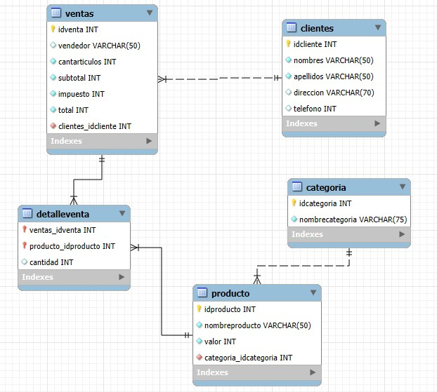
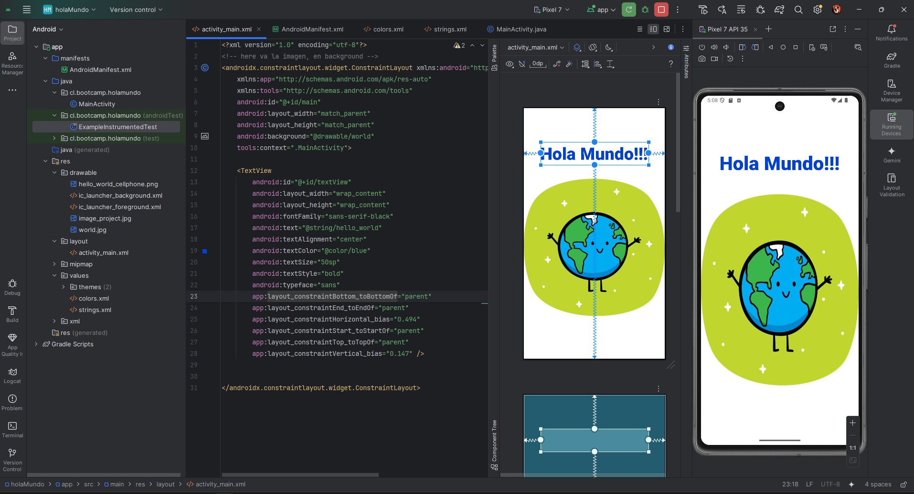

**_<h1 align="center">:vulcan_salute: Ejercicios Plataforma :computer:</h1>_**

  Repositorio vitrina que reúne los módulos y trabajos desarrollados durante el bootcamp.
 
  Cada bloque resume el contenido principal y permite acceder tanto al repositorio de cada proyecto
  como a la versión web publicada.

<!-- ---------------------------------------------------------------------------------------------- -->

**<h2>&#128204;Página Web del Proyecto</h2>**

[GitHub Pages - Proyectos Bootcamp Desarrollo Aplicaciones Móviles](https://kathyalde21.github.io/ejercicios_bootcamp_app_mov/)

<!-- ---------------------------------------------------------------------------------------------- -->

 
<table>
  <tr>
    <td align="center" width="24%">
        
      <strong>Pseudocódigo</strong> 
      
PSeint

    </td>
    <td align="center" width="24%">
        
      <strong>Bases de Datos Relacionales</strong> 
      
MySQL

    </td>
    <td align="center" width="24%">
        
      <strong>Java</strong> 
      
Eclipse

    </td>
    <td align="center" width="24%">
        
      <strong>Android</strong> 
      
Android Studio

    </td>
  </tr>
</table>

<!-- ---------------------------------------------------------------------------------------------- -->

**<h2>&#128204;Módulos y Trabajos Desarrollados</h2>**

<h3 id="modulo-1">📘 Módulo 1 - Fundamentos de Programación en Java</h3>

  <a href="./docs/modulo-1.md">📄 Ver detalle del módulo</a> •
  <a href="https://kathyalde21.github.io/ejercicios_bootcamp_app_mov/sitiosModulo1.html">🌐 Ver versión web</a>

<h3 id="modulo-2">📘 Módulo 2 - Fundamentos de Programación en Java</h3>

  <a href="./docs/modulo-2.md">📄 Ver detalle del módulo</a> •
  <a href="https://kathyalde21.github.io/ejercicios_bootcamp_app_mov/sitiosModulo2.html">🌐 Ver versión web</a>

<h3 id="modulo-3">📘 Módulo 3 - Fundamentos de Bases de Datos Relacionales</h3>

  <a href="./docs/modulo-3.md">📄 Ver detalle del módulo</a> •
  <a href="https://kathyalde21.github.io/ejercicios_bootcamp_app_mov/sitiosModulo3.html">🌐 Ver versión web</a>

<h3 id="modulo-4">📘 Módulo 4 - Desarrollo de la Interfaz de Usuario Android</h3>

  <a href="./docs/modulo-4.md">📄 Ver detalle del módulo</a> •
  <a href="https://kathyalde21.github.io/ejercicios_bootcamp_app_mov/sitiosModulo4.html">🌐 Ver versión web</a>

<h3 id="modulo-5">📘 Módulo 5 - Arquitectura y Ciclo de Vida de Componentes Android</h3>

  <a href="./docs/modulo-5.md">📄 Ver detalle del módulo</a> •
  <a href="https://kathyalde21.github.io/ejercicios_bootcamp_app_mov/sitiosModulo5.html">🌐 Ver versión web</a>

<h3 id="modulo-6">📘 Módulo 6 - Desarrollo de Aplicaciones Empresariales Android</h3>

  <a href="./docs/modulo-6.md">📄 Ver detalle del módulo</a> •
  <a href="https://kathyalde21.github.io/ejercicios_bootcamp_app_mov/sitiosModulo6.html">🌐 Ver versión web</a>

<h3 id="modulo-7">📘 Módulo 7 - Desarrollo de Portafolio de un Producto Digital</h3>

  <a href="./docs/modulo-7.md">📄 Ver detalle del módulo</a> •
  <a href="https://kathyalde21.github.io/ejercicios_bootcamp_app_mov/sitiosModulo7.html">🌐 Ver versión web</a>

<h3 id="proyectos-clases">📘 Proyectos en Clases</h3>

  <a href="./docs/proyectos-clases.md">📄 Ver detalle del módulo</a> •
  <a href="https://kathyalde21.github.io/ejercicios_bootcamp_app_mov/proyectosClases.html">🌐 Ver versión web</a>

