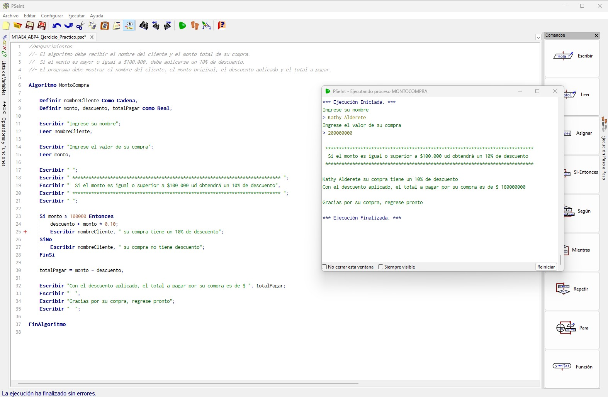
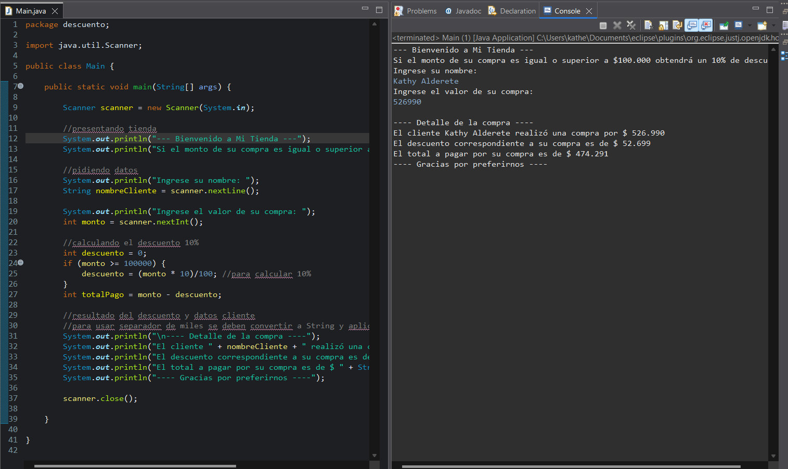
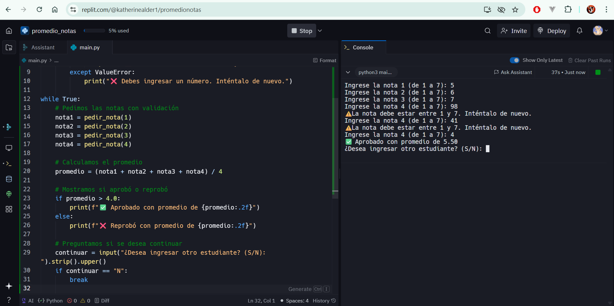
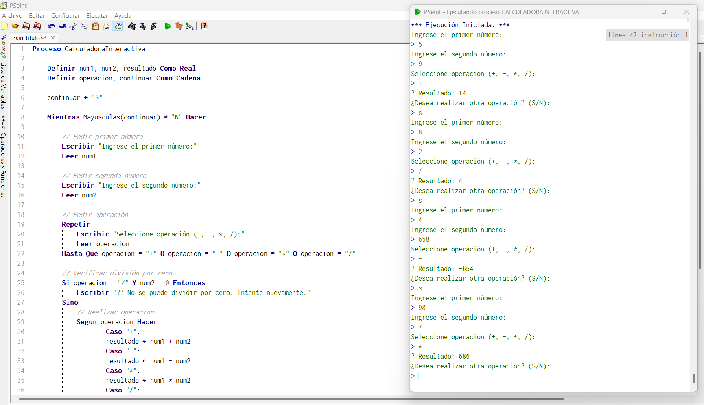
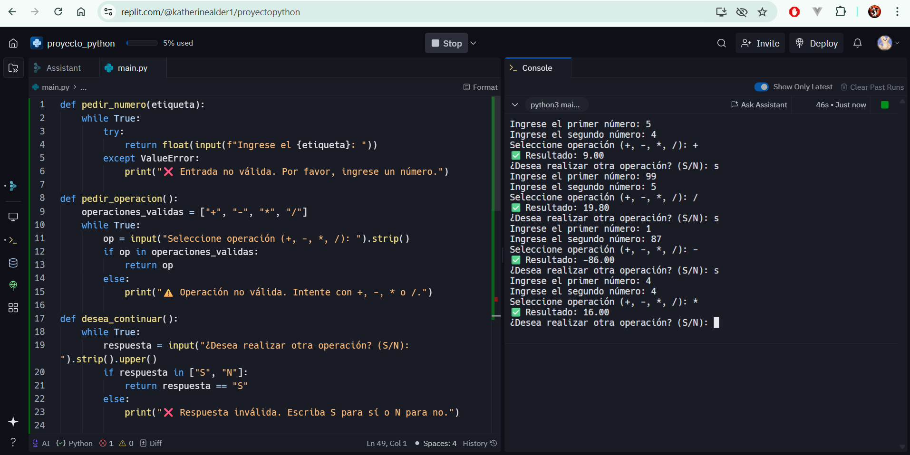
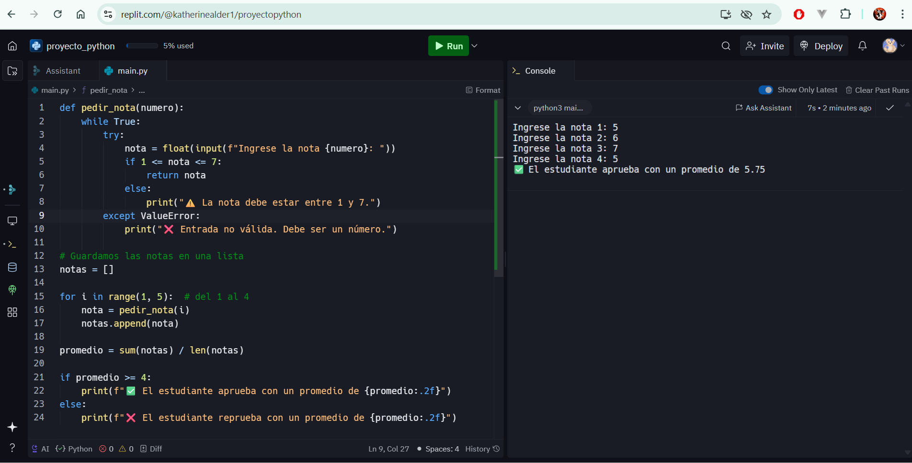

**_<h1 align="center">:vulcan_salute: Ejercicios Plataforma :computer:</h1>_**

<!-- ---------------------------------------------------------------------------------------------- -->

**<h2 align="center">&#128204; Módulo 2 - Fundamentos de Programación en Java</h2>**

[GitHub Pages - Proyectos Módulo 2 - Bootcamp Desarrollo Aplicaciones Móviles](https://kathyalde21.github.io/ejercicios_bootcamp_app_mov/sitiosModulo2.html)

<!-- ---------------------------------------------------------------------------------------------- -->

<!-- SEGMENTO DE 3 -->
<table>
    <tr>
        <td align="center" width="66%">
            
            
            
            <strong>Descuento</strong> 
            
Proyecto de descuento 10% según monto de compra.

            | <a class="readme-link" href="https://github.com/KathyAlde21/ejerciciosPseint/blob/main/ejercicio_practico_4/descuento10porciento.psc">
            Proyecto en PSeint</a> •
            <a class="readme-link" href="https://github.com/KathyAlde21/descuento_java">
            Proyecto en Java</a> | 
        </td>
        <td align="center" width="33%">
             
            <strong>Promedio de Notas</strong> 
            
De acuerdo al promedio de notas permite aprobar.

            | <a class="readme-link" href="https://github.com/KathyAlde21/promedio_notas_python">
            Proyecto Python con IA</a> | 
        </td>
    </tr>
    <tr>
     
        <td align="center" width="66%">
              
            
            
            
            <strong>Calculadora Interactiva</strong> 
            
Código modificado para ser utilizado como una calculadora.

            | <a class="readme-link" href="https://github.com/KathyAlde21/calculadora_interactiva_python_pseint">
            Proyecto en PSeint • Proyecto Python con IA</a> | 
        </td>
        <td align="center" width="33%">
              
             
            <strong>Evaluación de Notas</strong> 
            
Evalua promedio de notas para indicar si se aprueba.

            | <a class="readme-link" href="https://github.com/KathyAlde21/notas_apruebo_python">
            Proyecto Python con IA</a> | 
        </td>
    </tr>
</table>

