**_<h1 align="center">:vulcan_salute: Ejercicios Plataforma :computer:</h1>_**

<!-- ---------------------------------------------------------------------------------------------- -->

**<h2 align="center">&#128204; Módulo 2 - Fundamentos de Programación en Java</h2>**

[GitHub Pages - Proyectos Módulo 2 - Bootcamp Desarrollo Aplicaciones Móviles](https://kathyalde21.github.io/ejercicios_bootcamp_app_mov/sitiosModulo2.html)

<!-- ---------------------------------------------------------------------------------------------- -->

<!-- SEGMENTO DE 2 -->
<table>
    <tr>
        <td align="center" width="50%">
              
            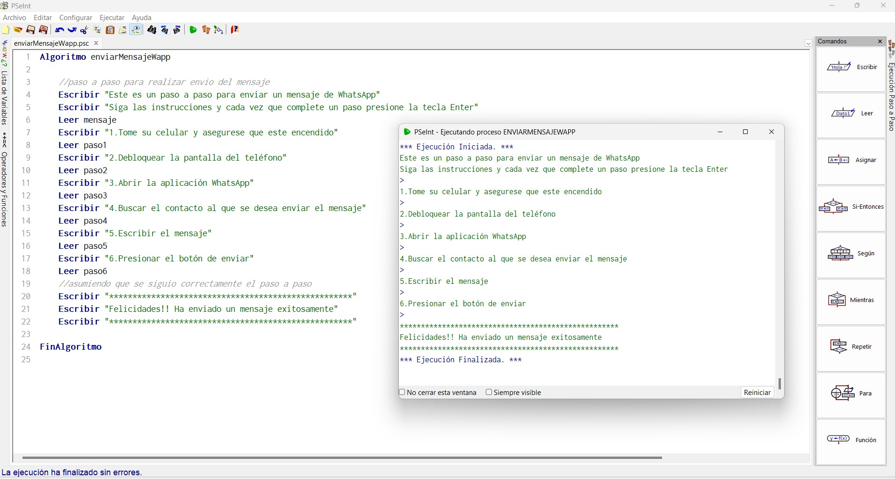
            
            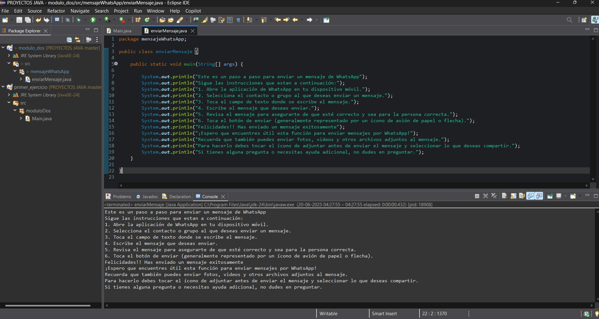 
            <strong>Mensaje de WhatsApp</strong> 
            
Consiste en establecer un paso a paso de como enviar un mensaje de WhatsApp, en PSeInt y Java.

            | <a class="readme-link" href="https://github.com/KathyAlde21/ejerciciosPseint/blob/main/ejercicio_practico_1/enviarMensajeWapp.psc">
            Proyecto en PSeInt</a> •
            <a class="readme-link" href="https://github.com/KathyAlde21/proyectos_java_app_mov/tree/master/modulo_dos/src/mensajeWhatsApp">
            Proyecto en Java</a> | 
        </td>
        <td align="center" width="50%">
              
            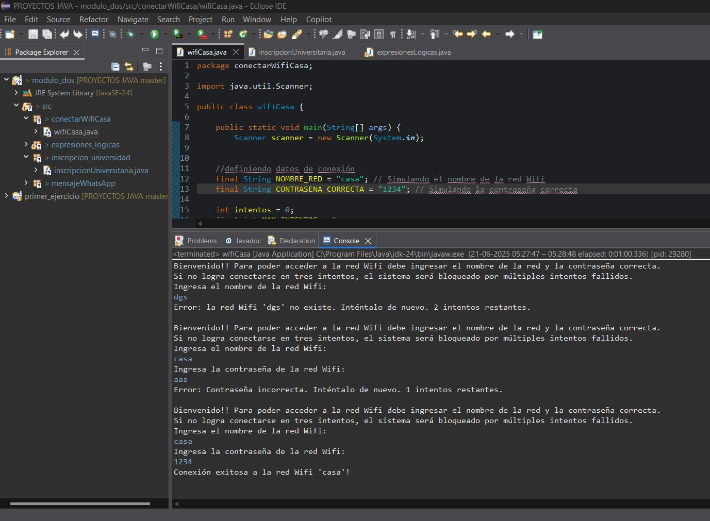
            
            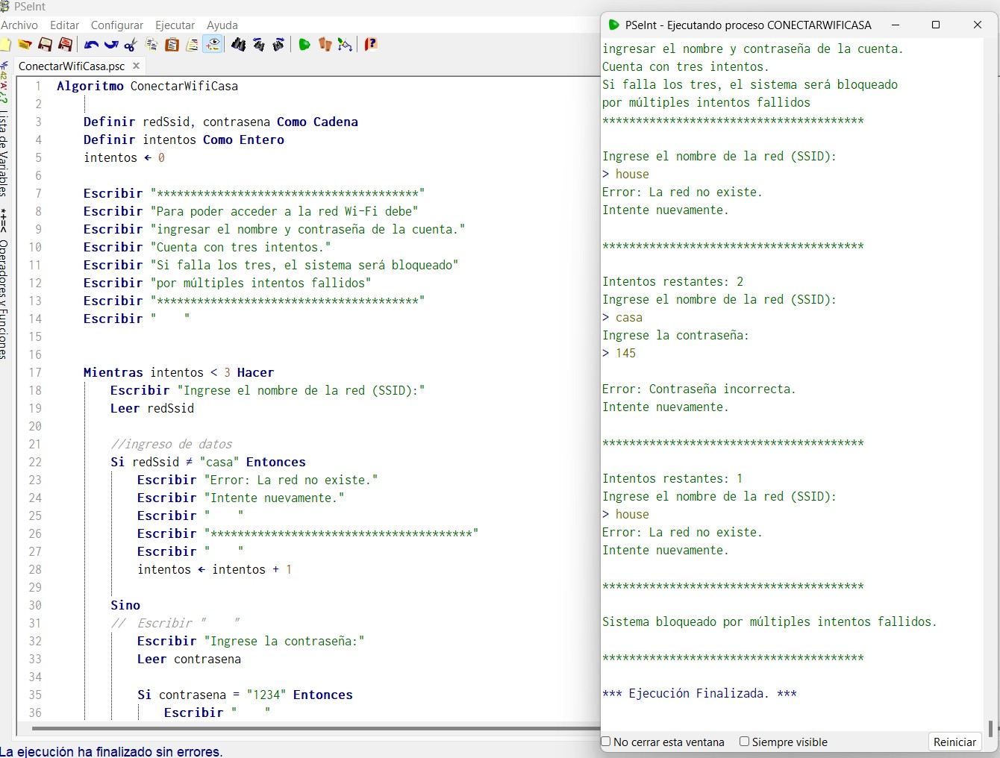 
            <strong>Conectar Wifi</strong> 
            
Representa el proceso de conexión de un dispositivo a una red Wifi, validando nombre de la red y contraseña, en PSeInt y Java.

            | <a class="readme-link" href="https://github.com/KathyAlde21/ejerciciosPseint/blob/main/ejercicio_practico_2/ConectarWifiCasa.psc">
            Proyecto en PSeint</a> •
            <a class="readme-link" href="https://github.com/KathyAlde21/proyectos_java_app_mov/tree/master/modulo_dos/src/conectarWifiCasa">
            Proyecto en Java</a> | 
        </td>
    </tr>
    <tr>
        <td align="center" width="50%">
              
            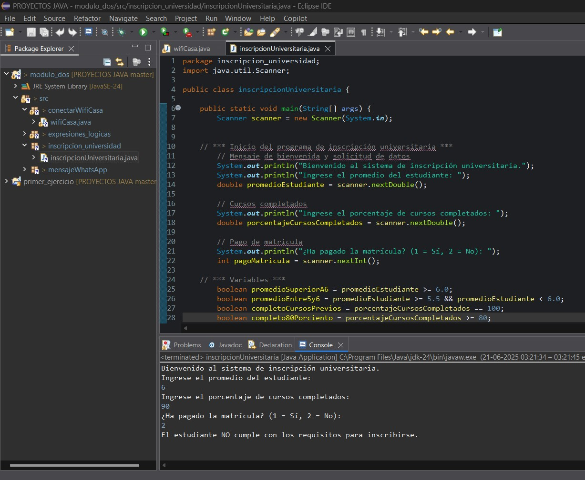
            
            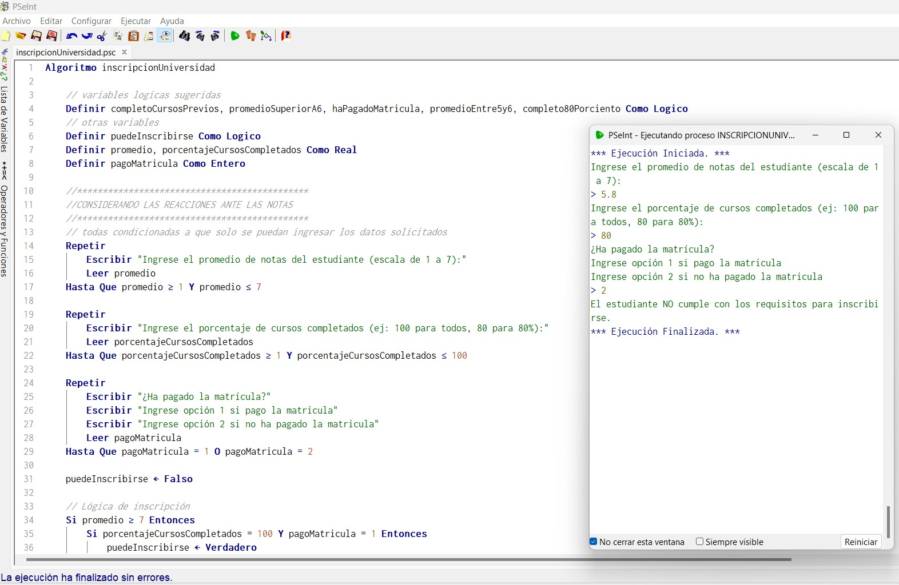 
            <strong>Matricula Universitaria</strong> 
            
Proyecto que valida que los estudiantes cumplan requisitos para permitir inscripción a los cursos.

            | <a class="readme-link" href="https://github.com/KathyAlde21/ejerciciosPseint/blob/main/ejercicio_practico_3/inscripcionUniversidad.psc">
            Proyecto en PSeint</a> •
            <a class="readme-link" 
            href="https://github.com/KathyAlde21/proyectos_java_app_mov/blob/master/modulo_dos/src/inscripcion_universidad/inscripcionUniversitaria.java">
            Proyecto en Java</a> | 
        </td>
        <td align="center" width="50%">
              
            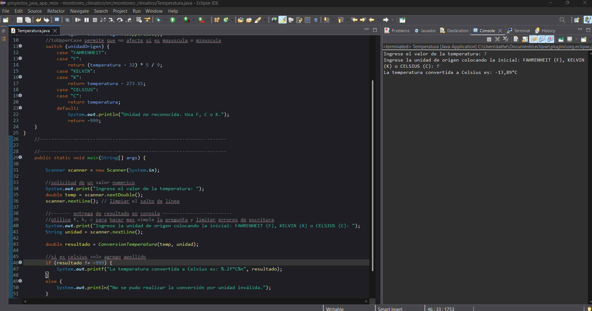
            
            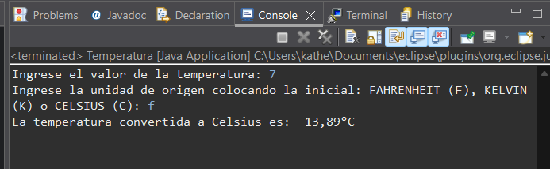 
            <strong>Monitoreo del Cambio Climático</strong> 
            
Monitoreo del Cambio Climático, ingreso de temperatura y conversión a Farenheit, Kelvin y Celsius.

            | <a class="readme-link" href="https://github.com/KathyAlde21/monitoreo_climatico">
            Proyecto en Java</a> | 
        </td>
    </tr>
</table>

<!-- SEGMENTO DE 4 POR FILA -->
<table>
    <tr>
        <td align="center" width="24%">
              
            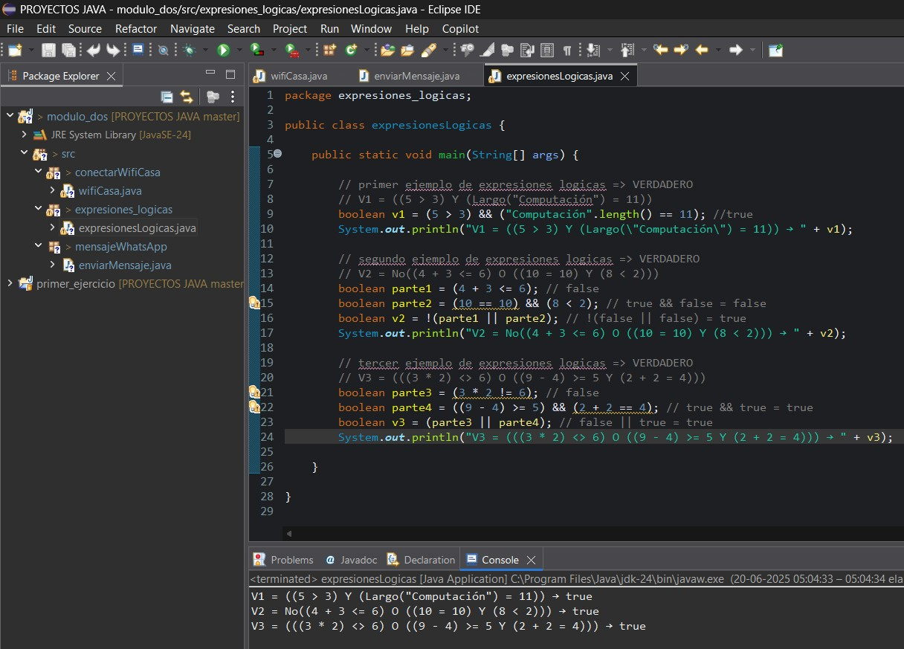 
            <strong>Expresiones Lógicas, Booleanos</strong> 
            
El proposito era analisar y resolver expresiones lógicas.

            | <a class="readme-link" href="https://github.com/KathyAlde21/proyectos_java_app_mov/tree/master/modulo_dos/src/expresiones_logicas">
            Proyecto en Java</a> | 
        </td>
        <td align="center" width="24%">
              
            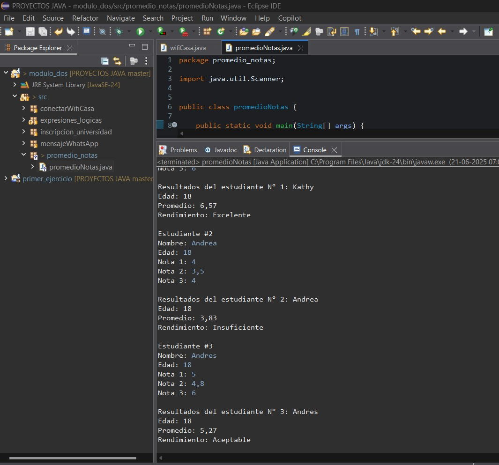 
            <strong>Promedio de Notas</strong> 
            
Procesa las notas ingresadas y promedio, entrega mensajes diferentes con nota y datos alumno.

            | <a class="readme-link" href="https://github.com/KathyAlde21/proyectos_java_app_mov/tree/master/modulo_dos/src/promedio_notas">
            Proyecto en Java</a> | 
        </td>
        <td align="center" width="24%">
              
            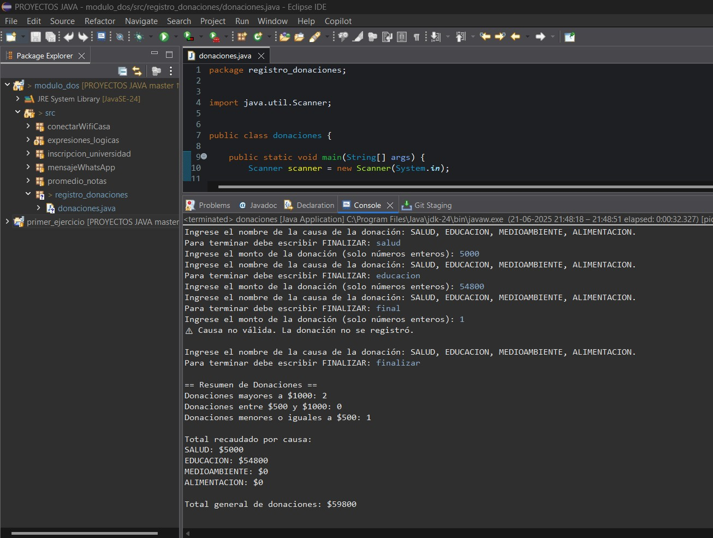 
            <strong>Registro de donaciones</strong> 
            
El objetivo es conocer el monto recaudado y la causa, en contexto de una campaña de donaciones.

            | <a class="readme-link" href="https://github.com/KathyAlde21/proyectos_java_app_mov/tree/master/modulo_dos/src/registro_donaciones">
            Proyecto en Java</a> | 
        </td>
        <td align="center" width="24%">
              
            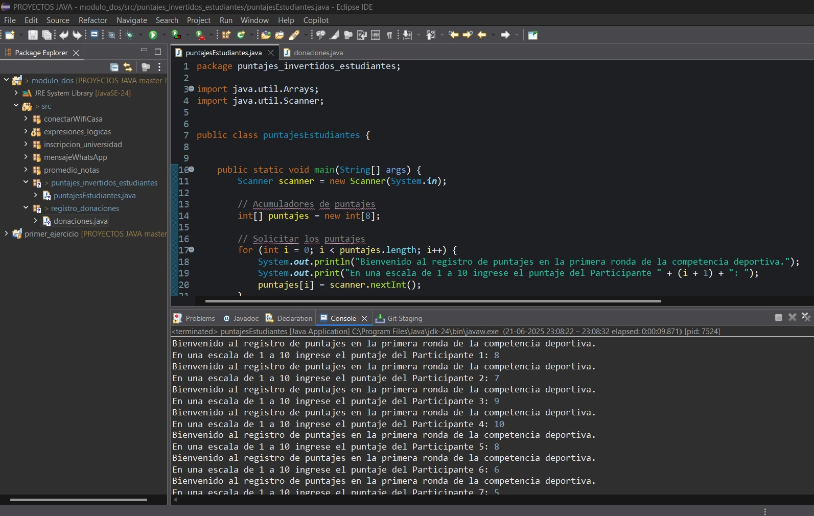 
            <strong>Competencia Deportiva</strong> 
            
Puntaje obtenido de acuerdo a datos ingresados se entregan ordenados de forma inversa.

            | <a class="readme-link" href="https://github.com/KathyAlde21/proyectos_java_app_mov/tree/master/modulo_dos/src/puntajes_invertidos_estudiantes">
            Proyecto en Java</a> | 
        </td>
    </tr>
    <!-- 4 fila dos -->
    <tr>
        <td align="center" width="24%">
              
            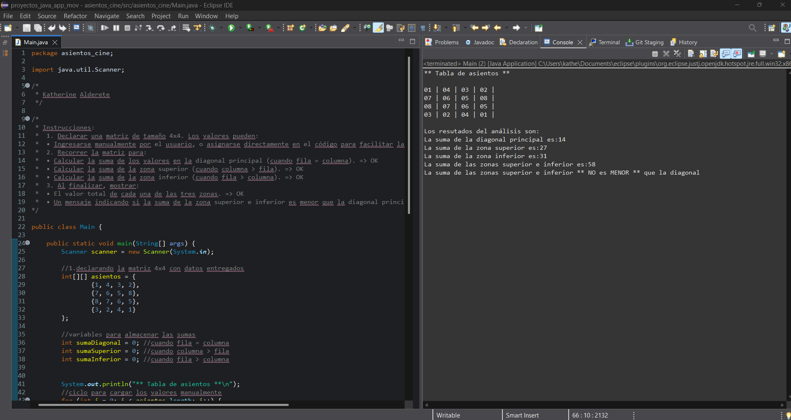 
            <strong>Asientos en el Cine</strong> 
            
Matriz con valores asignados que suma valores mostrando como resultado el valor de cada zona.

            | <a class="readme-link" href="https://github.com/KathyAlde21/asientos_cine_matriz_java">
            Proyecto en Java</a> | 
        </td>
        <td align="center" width="24%">
              
            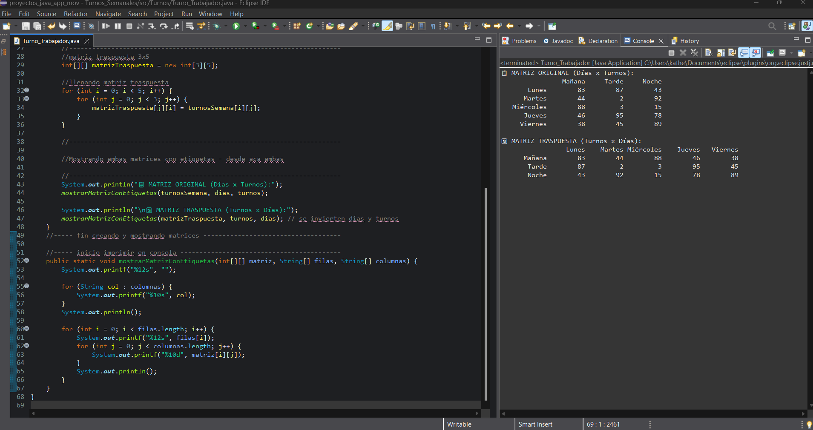 
            <strong>Turnos Semanales</strong> 
            
De acuerdo a matriz de 5x3 simula turnos, el orden en dos orden días x turnos y turnos x días.

            | <a class="readme-link" href="https://github.com/KathyAlde21/turnos_trabajador">
            Proyecto en Java</a> | 
        </td>
        <td align="center" width="24%">
              
            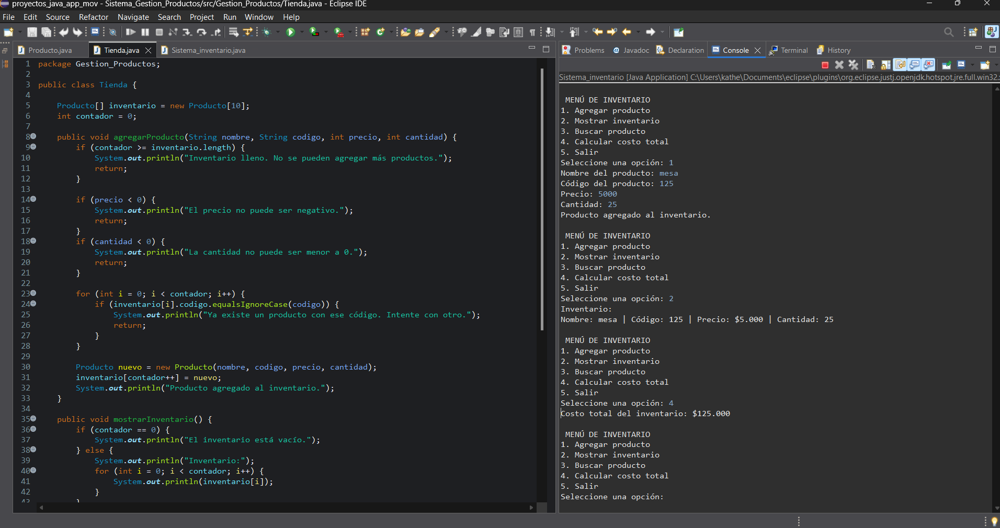 
            <strong>Gestion de Inventario</strong> 
            
Gestion de Inventario, incorporando por Consola para realizar los calculos.

            | <a class="readme-link" href="https://github.com/KathyAlde21/gestion_de_productos">
            Proyecto en Java</a> | 
        </td>
        <td align="center" width="24%">
              
            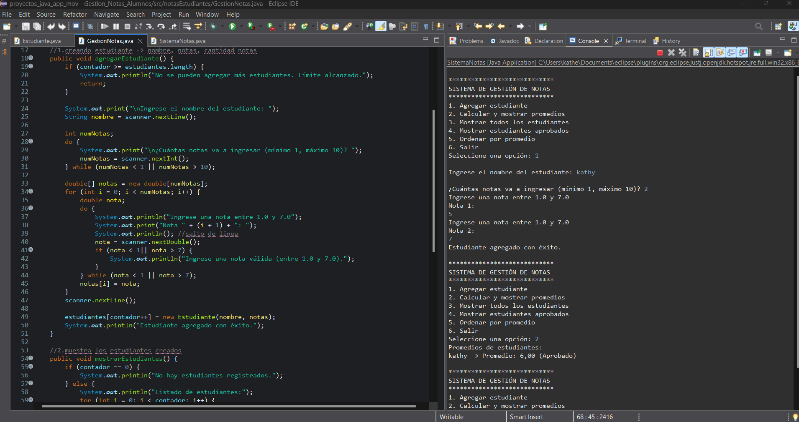 
            <strong>Gestion de Notas</strong> 
            
Permite crear estudiante, notas, calcular promedio y determinar si aprobaron o no.

            | <a class="readme-link" href="https://github.com/KathyAlde21/gestion_de_notas">
            Proyecto en Java</a> | 
        </td>
    </tr>
    <!-- 4 fila tres -->
    <tr>
        <td align="center" width="24%">
              
            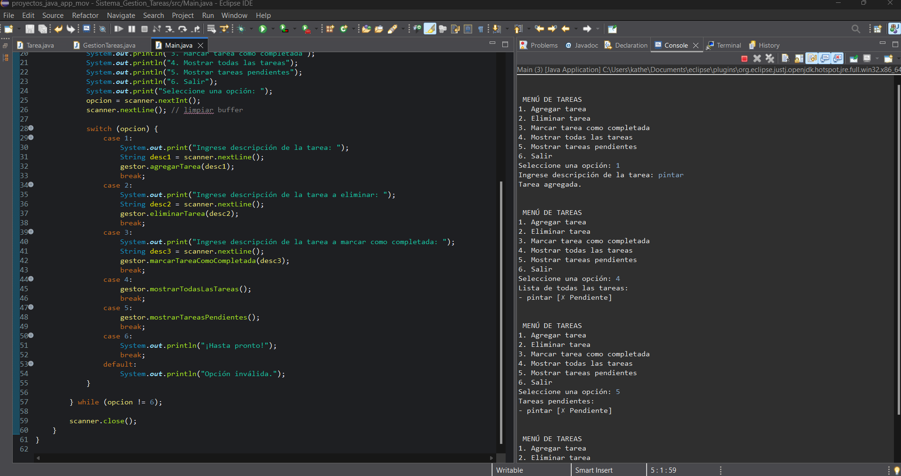 
            <strong>Gestion de Tareas</strong> 
            
A traves de consola se gestionan tareas pendientes agregando, eliminando, marcando y mostrando.

            | <a class="readme-link" href="https://github.com/KathyAlde21/gestion_de_tareas">
            Proyecto en Java</a> | 
        </td>
        <td align="center" width="24%">
              
            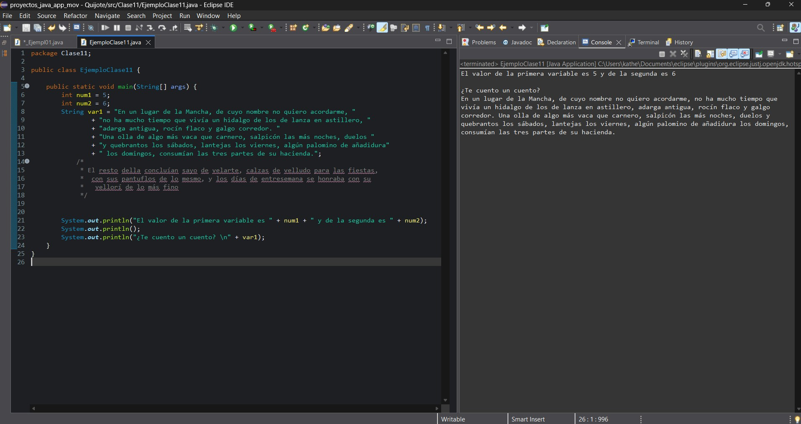 
            <strong>Quijote</strong> 
            
Utiliza las buenas prácticas en la creación de una nueva clase e implementar en consola.

            | <a class="readme-link" href="https://github.com/KathyAlde21/clase_nueva_quijote">
            Proyecto en Java</a> | 
        </td>
        <td align="center" width="24%">
              
            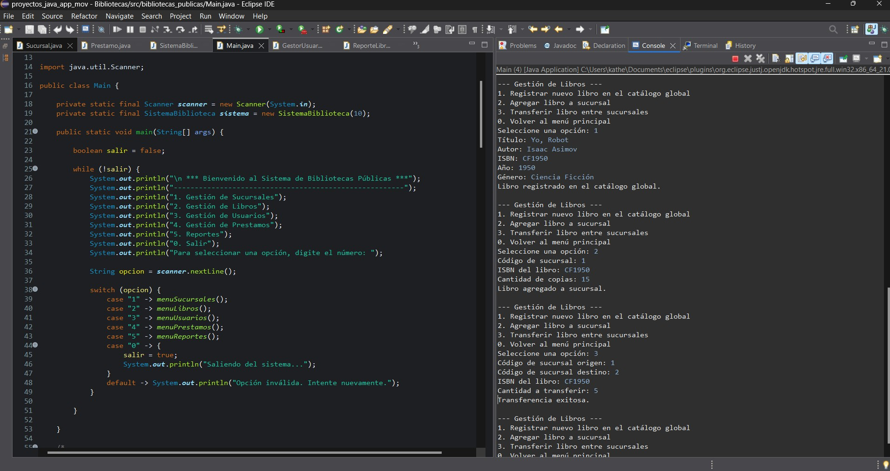 
            <strong>Biblioteca</strong> 
            
Permite trabajar con Usuarios, Sucursales, Libros, Prestamos y generar reportes.

            | <a class="readme-link" href="https://github.com/KathyAlde21/biblioteca_gestion_libros_usuarios_sucursales_java">
            Proyecto en Java</a> | 
        </td>
        <td align="center" width="24%">
              
            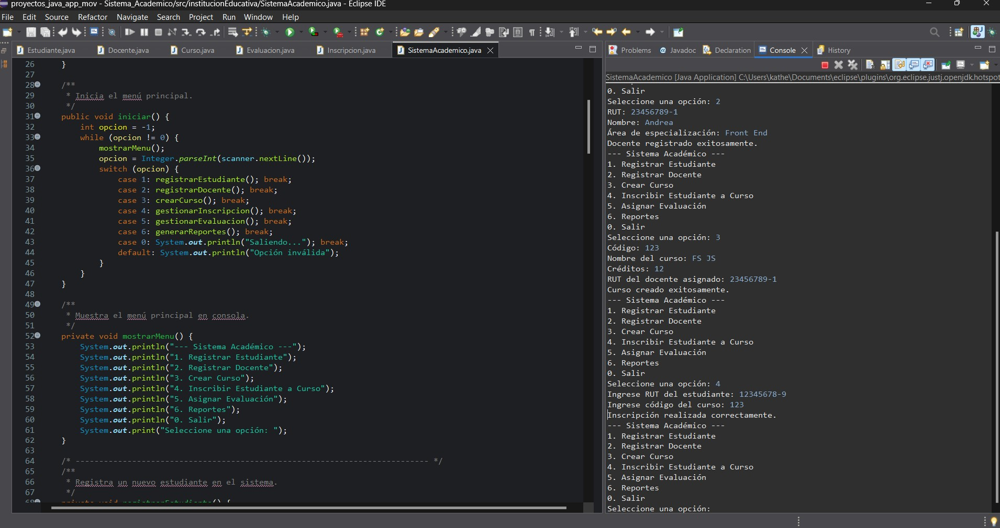 
            <strong>Sistema Academico</strong> 
            
Permite registrar estudiantes, docentes, curso, evaluaciones, reportes e inscribir alumnos.

            | <a class="readme-link" href="https://github.com/KathyAlde21/sistema_academico_java">
            Proyecto en Java</a> | 
        </td>
    </tr>
    <tr>
        <td align="center" width="24%">
              
            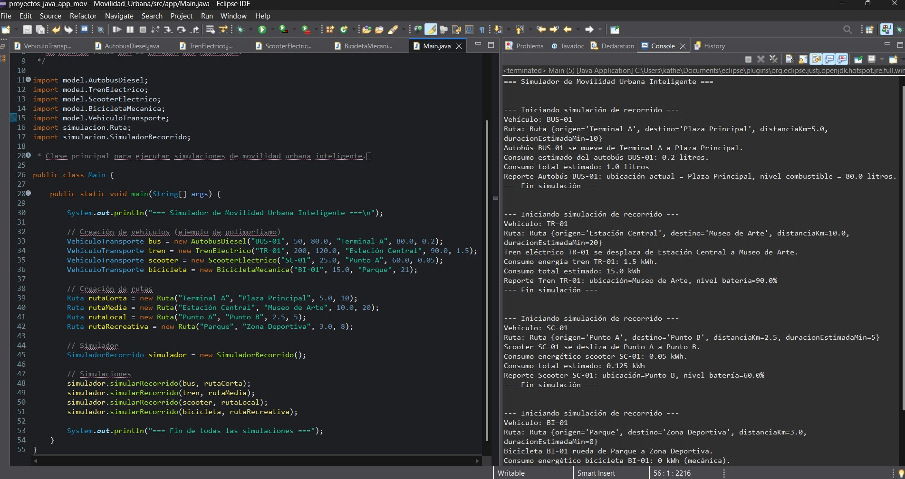 
            <strong>Movilidad Urbana</strong> 
            
Incluye uso de medios de transporte, combustibles y estadísticas operativas.

            | <a class="readme-link" href="https://github.com/KathyAlde21/movilidad_urbana_java">
            Proyecto en Java</a> | 
        </td>
        <td align="center" width="24%">
              
            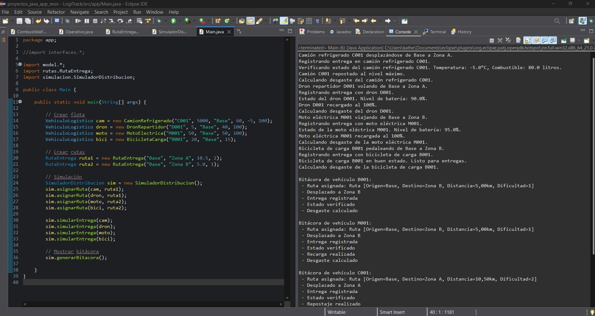 
            <strong>Simulador de Distribucion</strong> 
            
Permite gestionar la flota de vehículos y simular entregas.

            | <a class="readme-link" href="https://github.com/KathyAlde21/simulador_de_distribucion_java">
            Proyecto en Java</a> | 
        </td>
        <td align="center" width="24%">
              
            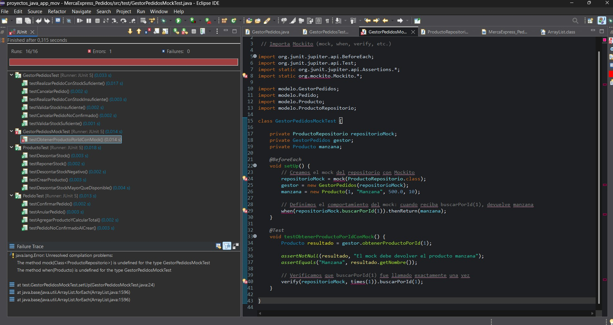 
            <strong>Pruebas Unitarias</strong> 
            
Pruebas Unitarias implementando JUnit para validar funcionamiento del sistema de pedidos.

            | <a class="readme-link" href="https://github.com/KathyAlde21/pruebas_unitarias_mercaexpress_pedidos_java.git">
            Proyecto en Java</a> | 
        </td>
        <td align="center" width="24%">
              
            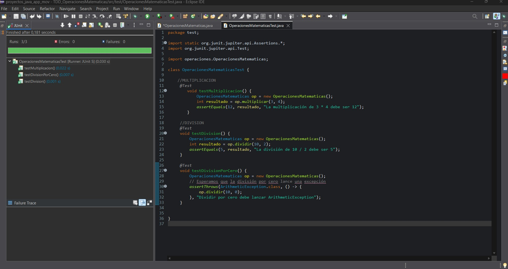 
            <strong>Operaciones Matemáticas</strong> 
            
Implementa operaciones como multiplicación y división.

            | <a class="readme-link" href="https://github.com/KathyAlde21/tdd_operaciones_matematicas_java">
            Proyecto en Java</a> | 
        </td>
    </tr>
</table>

**<h2>📘 Evaluación Final del Módulo 2</h2>**

<table>
    <tr>
        <td align="center">
            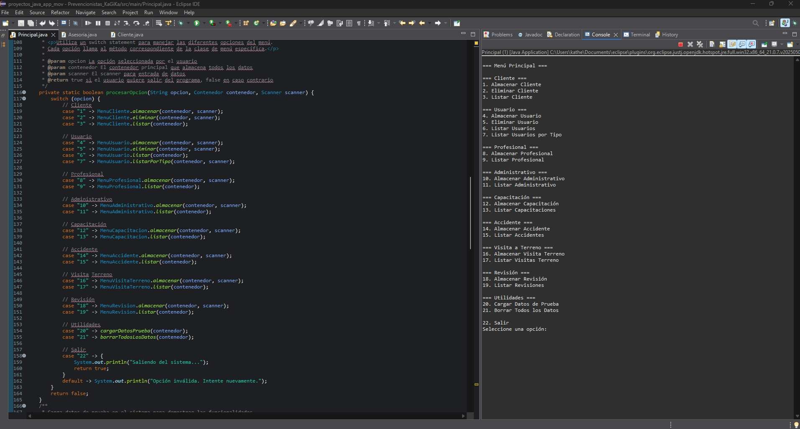 
            <strong>Prevención de Riesgos Laborales</strong> 
            
Solicita datos, valida, elimina y genera listados.

            | <a class="readme-link" href="https://github.com/KathyAlde21/final_m2_prevencionistas_kagika">
            Proyecto en Java</a> |
        </td>
    </tr>
</table>
