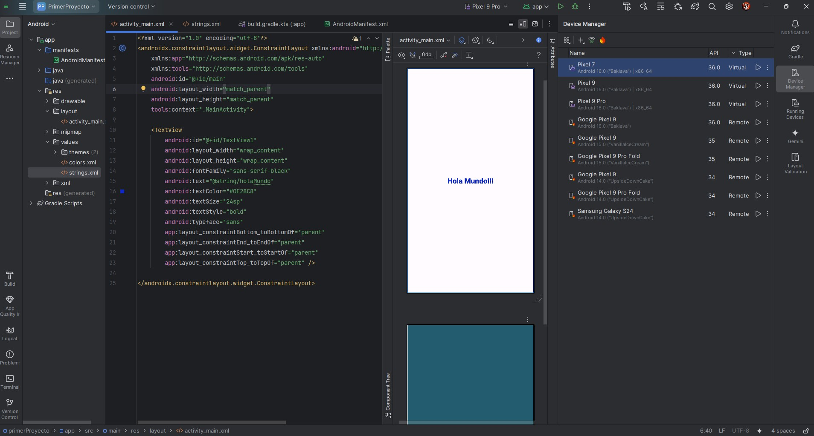
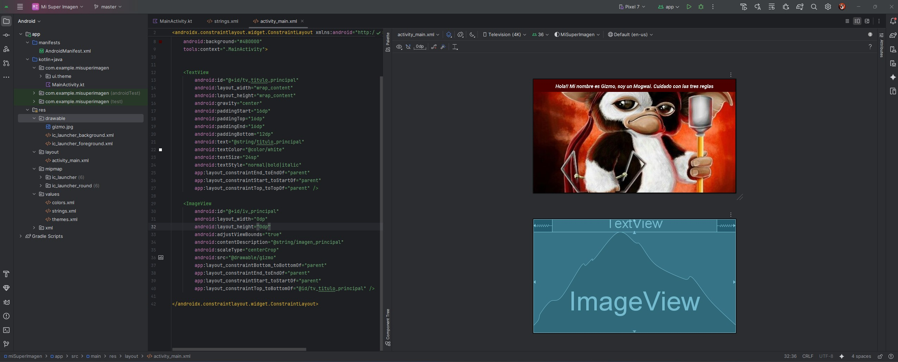
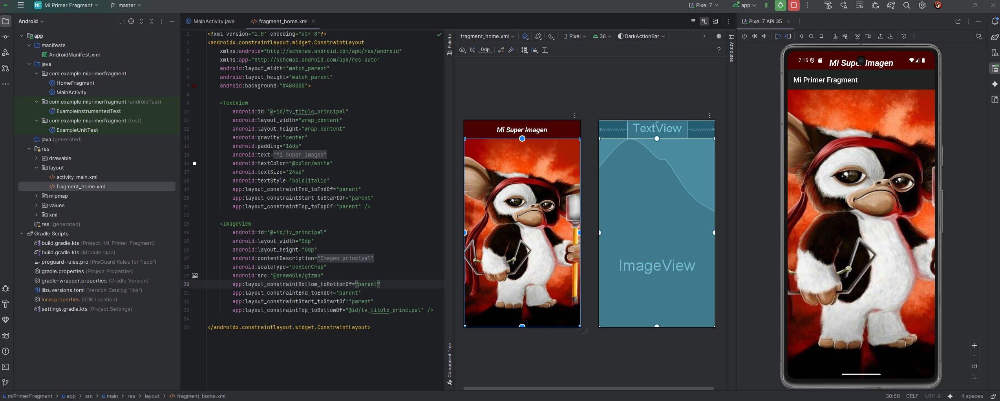
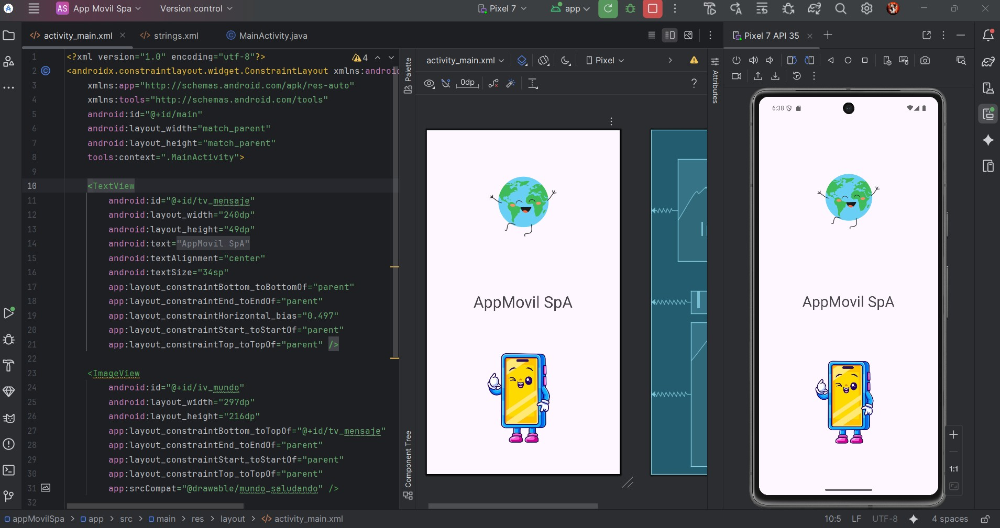
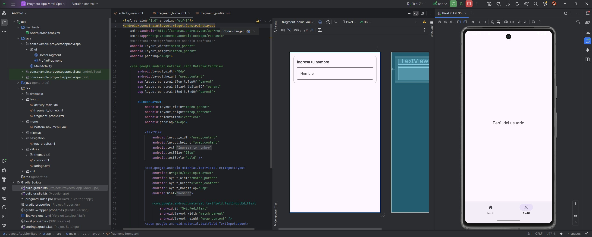
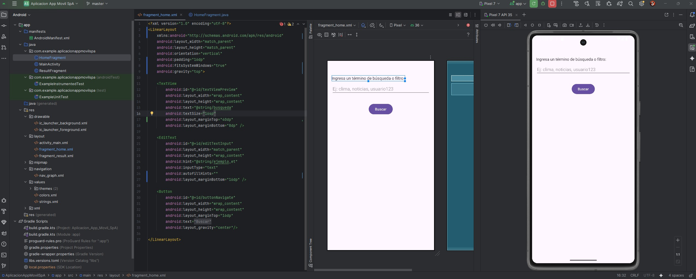
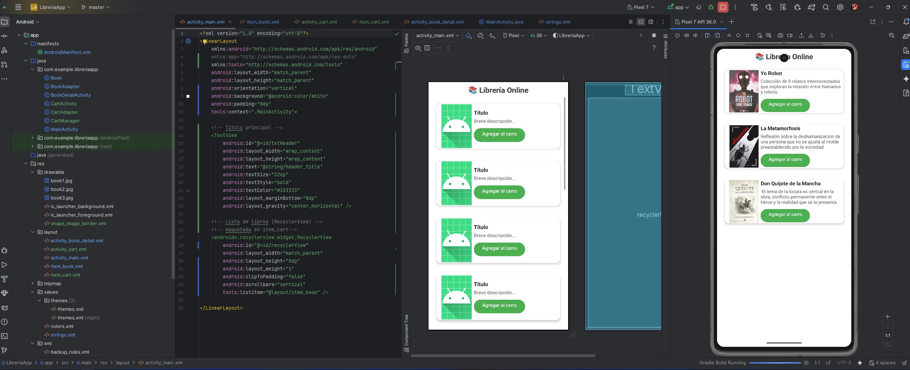
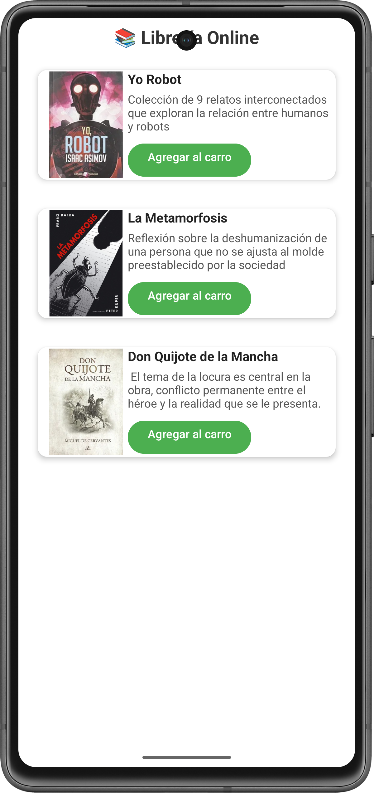

**_<h1 align="center">:vulcan_salute: Ejercicios Plataforma :computer:</h1>_**

<!-- ---------------------------------------------------------------------------------------------- -->

**<h2 align="center">&#128204; Módulo 4 - Desarrollo de la Interfaz de Usuario Android</h2>**

[GitHub Pages - Proyectos Módulo 4 - Bootcamp Desarrollo Aplicaciones Móviles](https://kathyalde21.github.io/ejercicios_bootcamp_app_mov/sitiosModulo4.html)

En este módulo comencé a trabajar directamente con la interfaz de usuario en Android, enfocándome en comprender la estructura visual de una aplicación, el uso del emulador y la relación entre diseño, componentes y comportamiento en pantalla.

Los ejercicios partieron con proyectos simples para validar el entorno y practicar elementos básicos de la interfaz, pero luego avanzaron hacia propuestas más completas, incluyendo adaptación a distintas orientaciones, uso de Material Design y trabajo con Fragments.

Una parte importante del módulo fue el desarrollo progresivo de AppMovil SpA, que me permitió ver cómo una misma aplicación podía ampliarse por etapas. También cerré el módulo con una evaluación final centrada en una aplicación de biblioteca, integrando interacción, visualización de datos y selección de elementos dentro de la interfaz.

<table>
    <tr>
        <td align="center" width="24%">
              
            <strong>Hola Mundo</strong> 
            
Proyecto inicial creado para validar la instalación del entorno y comprobar el funcionamiento del emulador.

            | <a class="readme-link" href="https://github.com/KathyAlde21/hola_mundo_app_mov_2025">
            Proyecto Android</a> | 
        </td>
        <td align="center" width="24%">
              
            <strong>Calculadora de propinas</strong> 
            
Aplicación Android que permite calcular la propina a partir de los valores ingresados.

            | <a class="readme-link" href="https://github.com/KathyAlde21/calculadora_propinas_android_java">
            Proyecto Android</a> | 
        </td>
        <td align="center" width="24%">
              
            <strong>Mi Super Imagen</strong> 
            
Proyecto orientado a mostrar una imagen de forma responsiva en distintos dispositivos.

            | <a class="readme-link" href="https://github.com/KathyAlde21/mi_super_imagen_android">
            Proyecto Android</a> | 
        </td>
        <td align="center" width="24%">
              
            <strong>Mi Super Imagen con Fragment</strong> 
            
Continuación del proyecto anterior, incorporando un Fragment con su respectivo layout.

            | <a class="readme-link" href="https://github.com/KathyAlde21/mi_primer_fragment_app">
            Proyecto Android</a> | 
        </td>
    </tr>
</table>

 
&#128203;Proyecto por etapas AppMovil SpA:
<table>
    <tr>
        <td align="center" width="33%">
              
            <strong>AppMovil SpA — Etapa 1</strong> 
            
Primera etapa del proyecto, desarrollada con dos imágenes y una frase principal para validar estructura visual básica.

            | <a class="readme-link" href="https://github.com/KathyAlde21/app_movil_spa">
            Proyecto Android</a> | 
        </td>
        <td align="center" width="33%">
              
            <strong>AppMovil SpA — Etapa 2</strong> 
            
Segunda etapa del proyecto, incorporando adaptación a orientación horizontal y continuidad visual de la app.

            | <a class="readme-link" href="https://github.com/KathyAlde21/app_movil_spa">
            Proyecto Android</a> | 
        </td>
        <td align="center" width="33%">
              
            <strong>AppMovil SpA — Etapa 3</strong> 
            
Etapa final del proyecto, con incorporación de componentes de Material Design y mejoras en la experiencia del usuario.

            | <a class="readme-link" href="https://github.com/KathyAlde21/app_movil_spa_con_fragment">
            Proyecto Android</a> | 
        </td>
    </tr>
</table>

 
&#128203;Evaluación Final del Módulo 4:
<table>
    <tr>
        <td align="center" width="100%">
            
             
            <strong>Aplicación Biblioteca</strong> 
            
Aplicación Android que muestra libros preingresados y permite seleccionarlos para agregarlos a un carro de compras.

            | <a class="readme-link" href="https://github.com/KathyAlde21/app_libreria_android">
            Proyecto Android</a> | 
        </td>
    </tr>
</table>