**_<h1 align="center">:vulcan_salute: Ejercicios Plataforma :computer:</h1>_**

<!-- ---------------------------------------------------------------------------------------------- -->

**<h2 align="center">&#128204; Módulo 5 - Arquitectura y Ciclo de Vida de Componentes Android</h2>**

[GitHub Pages - Proyectos Módulo 5 - Bootcamp Desarrollo Aplicaciones Móviles](https://kathyalde21.github.io/ejercicios_bootcamp_app_mov/sitiosModulo5.html)

<!-- ---------------------------------------------------------------------------------------------- -->

<table>
    <tr>
        <td align="center" width="25%">
            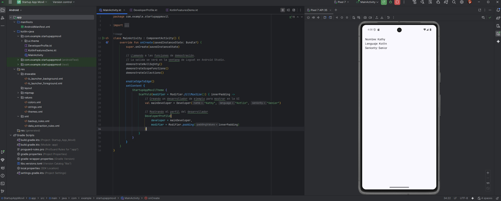  
            <strong>App Startup</strong> 
            
Aplicacion que muestra el uso de Kotlin para una Startup Aplicaciones Moviles.

            | <a class="readme-link" href="https://github.com/KathyAlde21/app_startup_aplicacion_movil">
            Proyecto en Android</a> | 
        </td>
        <td align="center" width="25%">
            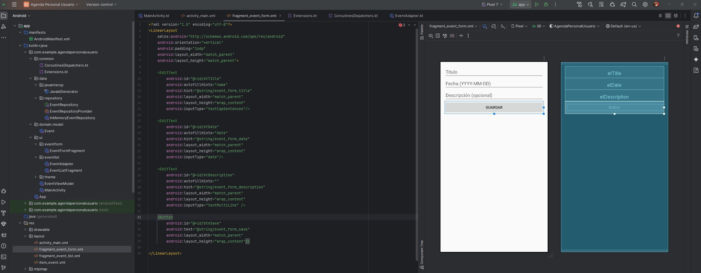  
            <strong>Agenda Personal</strong> 
            
Permite ingresar eventos con título, fecha y descripción.

            | <a class="readme-link" href="https://github.com/KathyAlde21/app_agenda_personal_usuario">
            Proyecto en Android</a> | 
        </td>
        <td align="center" width="50%">
            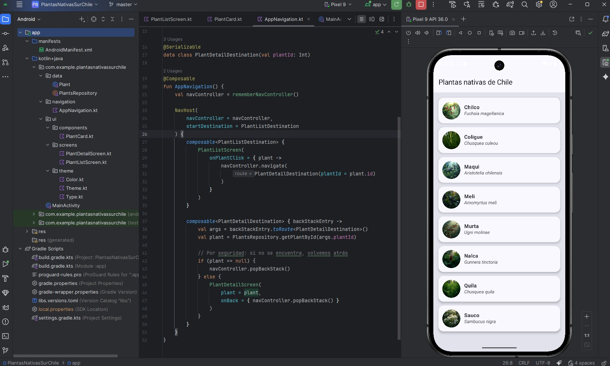
            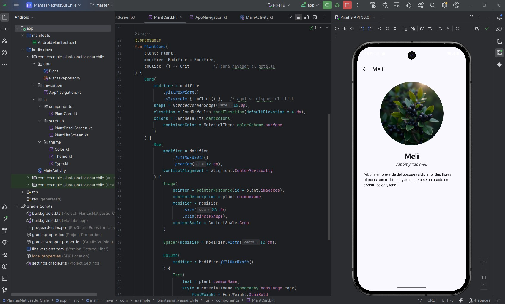
            <strong>Plantas Nativas Sur de Chile</strong> 
            
Muestra cards con nombres Plantas Nativas Sur de Chile, usando Jetpack Compose y evento onclick permite seleccionar
            una planta dentro de un listado.

            | <a class="readme-link" href="https://github.com/KathyAlde21/plantas_nativas_sur_de_chile_app">
            Proyecto en Android</a> | 
        </td>
    </tr>
</table>

<table>
    <tr>
        <td align="center" width="24%">
            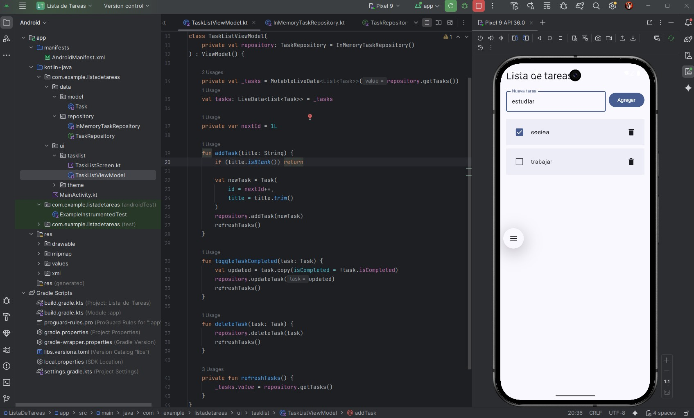  
            <strong>Lista de tareas</strong> 
            
Permite ingresar, eliminar y marcar como completada.

            | <a class="readme-link" href="https://github.com/KathyAlde21/app_lista_de_tareas">
            Proyecto en Android</a> | 
        </td>
        <td align="center" width="24%">
            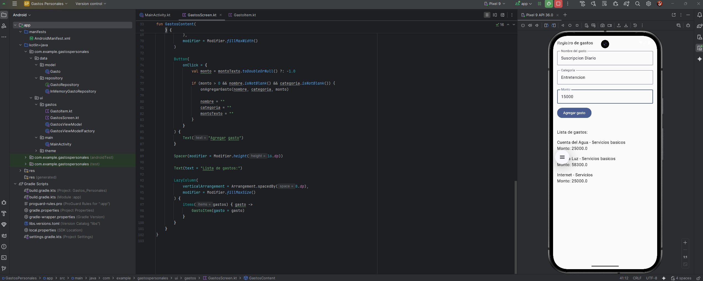  
            <strong>Gastos Personales</strong> 
            
Permite ingresar gastos con datos y monto.

            | <a class="readme-link" href="https://github.com/KathyAlde21/app_gastos_personales">
            Proyecto en Android</a> | 
        </td>
        <td align="center" width="24%">
            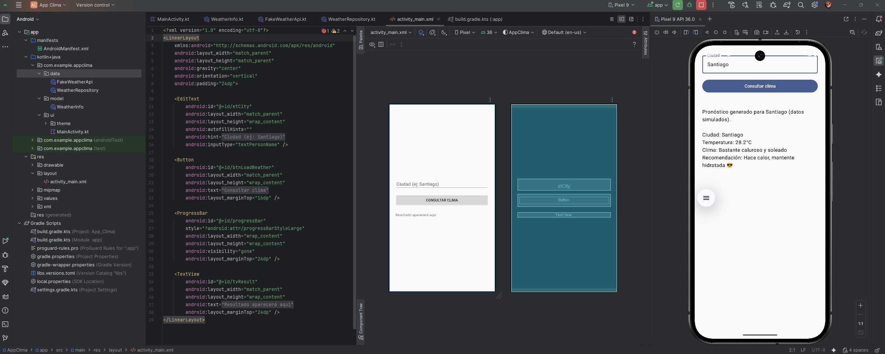  
            <strong>Clima con datos fake</strong> 
            
Simula llamado a API, async / await y uso de corutinas.

            | <a class="readme-link" href="https://github.com/KathyAlde21/app_clima_fake">
            Proyecto en Android</a> | 
        </td>
        <td align="center" width="24%">
            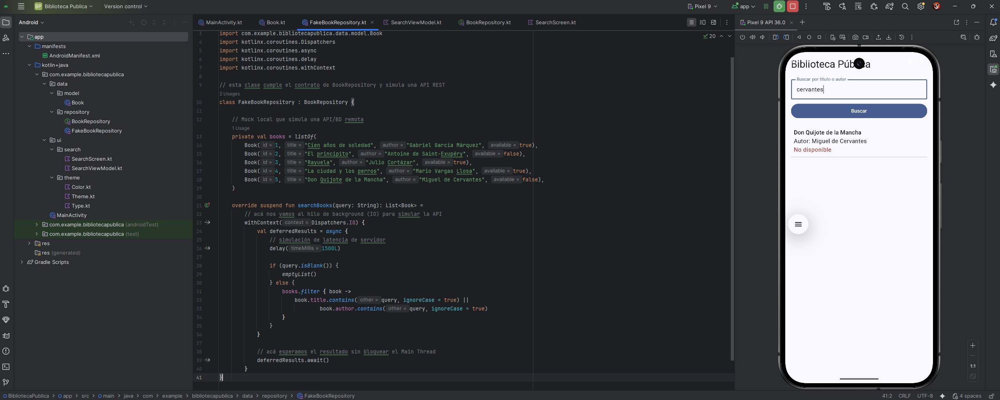  
            <strong>Buscador de Libros</strong> 
            
Busca libros según autor y titulo con datos pre-ingresados.

            | <a class="readme-link" href="https://github.com/KathyAlde21/app_biblioteca_publica.git">
            Proyecto en Android</a> | 
        </td>
    </tr>
</table>

 
&#128203;Evaluación Final del Módulo 5:
<table>
    <tr>
        <td align="center" width="100%">
            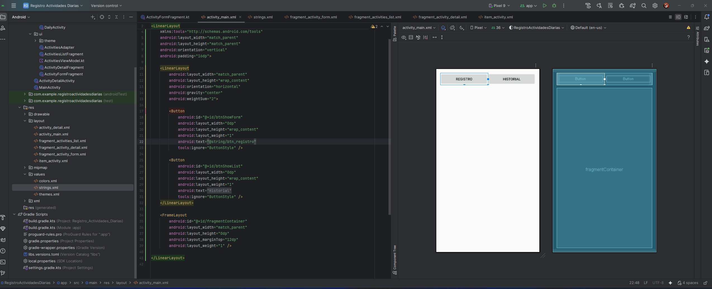
            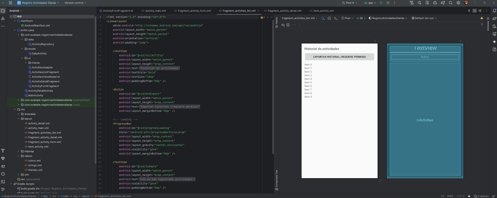
            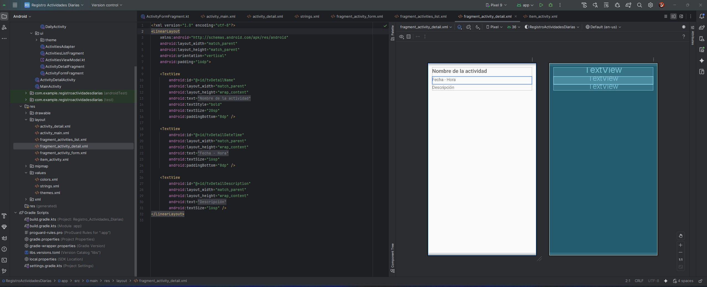
            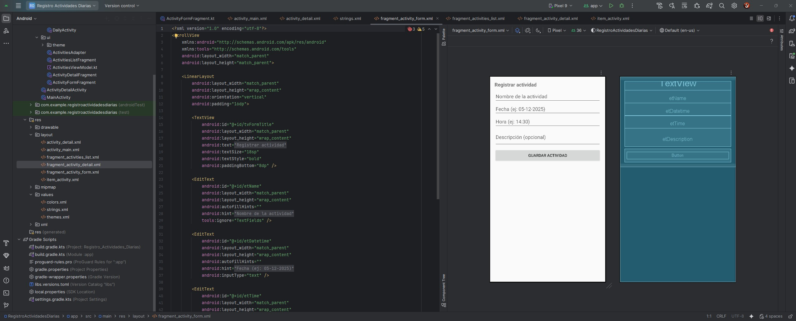 
            <strong>Registro Actividades</strong> 
            
Aplicación que permite al usuario ingresar sus actividades diarias, con fecha, hora y descripción.

            | <a class="readme-link" href="https://github.com/KathyAlde21/app_registro_actividades_diarias">
            Proyecto en Android</a> | 
        </td>
    </tr>
</table>

