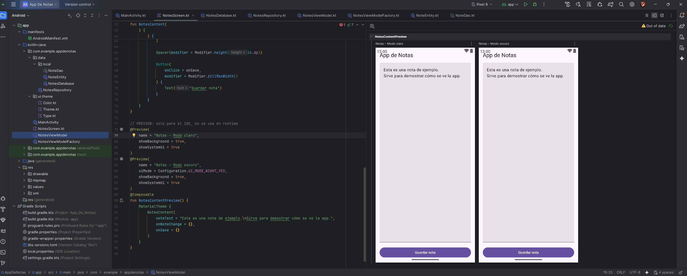
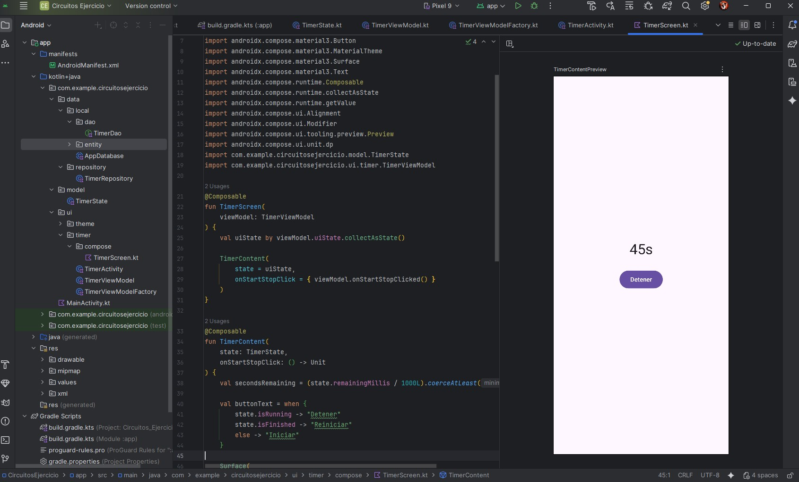
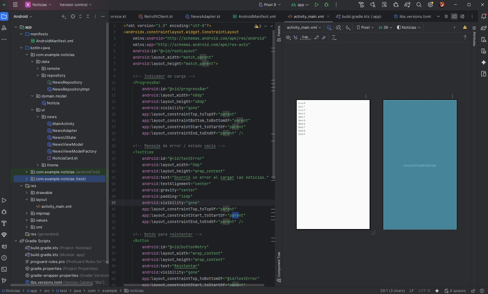
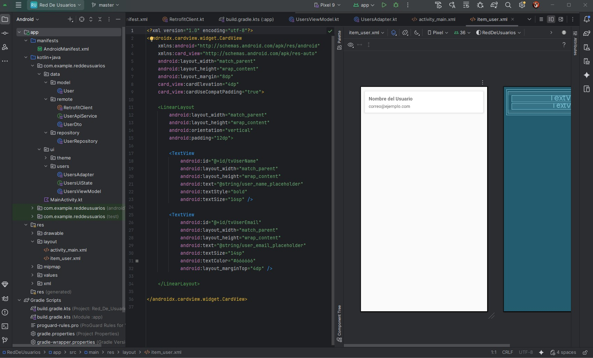

**_<h1 align="center">:vulcan_salute: Ejercicios Plataforma :computer:</h1>_**

<!-- ---------------------------------------------------------------------------------------------- -->

**<h2 align="center">&#128204; Módulo 6 - Desarrollo de Aplicaciones Empresariales Android</h2>**

[GitHub Pages - Proyectos Módulo 6 - Bootcamp Desarrollo Aplicaciones Móviles](https://kathyalde21.github.io/ejercicios_bootcamp_app_mov/sitiosModulo6.html)

En este módulo trabajé con aplicaciones Android más cercanas a una lógica empresarial, incorporando persistencia local, manejo de estado, temporizadores y consumo de datos externos.

Los ejercicios me permitieron profundizar en herramientas como Room, ViewModel, Jetpack Compose y Retrofit, aplicándolas en proyectos que combinaban interfaz, datos y comportamiento de la aplicación.

A diferencia de módulos anteriores más centrados en la construcción visual o en estructuras básicas, acá el foco estuvo en integrar componentes y tecnologías que hacen que una app sea más completa y funcional.

<table>
    <tr>
        <td align="center" width="50%">
              
            <strong>Aplicación de notas</strong> 
            
Aplicación Android desarrollada con Room, ViewModel y Jetpack Compose para gestionar notas y trabajar con persistencia local.

            | <a class="readme-link" href="https://github.com/KathyAlde21/app_de_notas_con_notescontentpreview">
            Proyecto Android</a> | 
        </td>
        <td align="center" width="50%">
              
            <strong>Temporizador para ejercicio</strong> 
            
Aplicación Android con temporizador orientado a circuitos de ejercicio, incluyendo vista previa de la interfaz.

            | <a class="readme-link" href="https://github.com/KathyAlde21/app_temporizador_circuitos_de_ejercicio">
            Proyecto Android</a> | 
        </td>
    </tr>
    <tr>
        <td align="center" width="50%">
              
            <strong>App de noticias</strong> 
            
Aplicación Android que consume datos JSON con Retrofit, utilizando un enlace raw alojado en otro repositorio.

            | <a class="readme-link" href="https://github.com/KathyAlde21/app_noticias_con_noticias.json.git">
            Proyecto Android</a> | 
        </td>
        <td align="center" width="50%">
              
            <strong>Datos de usuarios en red</strong> 
            
Aplicación Android que muestra datos de usuarios consumiendo un archivo JSON con Retrofit desde un recurso raw externo.

            | <a class="readme-link" href="https://github.com/KathyAlde21/app_red_usuarios_con_usuarios.json.git">
            Proyecto Android</a> | 
        </td>
    </tr>
</table>

