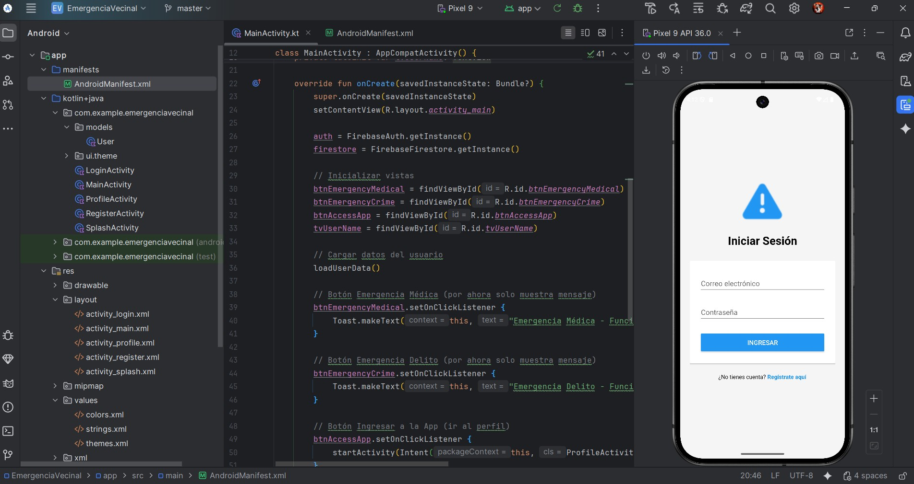

**_<h1 align="center">:vulcan_salute: Ejercicios Plataforma :computer:</h1>_**

<!-- ---------------------------------------------------------------------------------------------- -->

**<h2 align="center">&#128204; Módulo 7 - Desarrollo de Portafolio de un Producto Digital</h2>**

[GitHub Pages - Proyectos Módulo 7 - Bootcamp Desarrollo Aplicaciones Móviles](https://kathyalde21.github.io/ejercicios_bootcamp_app_mov/sitiosModulo7.html)

<!-- ---------------------------------------------------------------------------------------------- -->

&#128203;App. de Seguridad con Alerta Vecinal:

- Proyecto desarrollado en 4 etapas incrementando las funcionalidades.
- Aplicación con botones de alerta de salud y seguridad.
- [Link repositorio](https://github.com/KathyAlde21/app_seg_vec_nvp)

  
