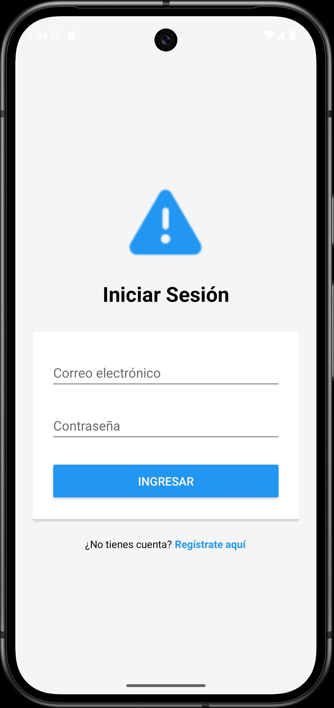

**_<h1 align="center">:vulcan_salute: Ejercicios Plataforma :computer:</h1>_**

<!-- ---------------------------------------------------------------------------------------------- -->

**<h2 align="center">&#128204; Módulo 7 - Desarrollo de Portafolio de un Producto Digital</h2>**

[GitHub Pages - Proyectos Módulo 7 - Bootcamp Desarrollo Aplicaciones Móviles](https://kathyalde21.github.io/ejercicios_bootcamp_app_mov/sitiosModulo7.html)

En este módulo el trabajo se concentró en el desarrollo del proyecto final de todo el curso, abordado como un NVP (producto mínimo viable) con una base funcional clara y posibilidad de crecimiento.

La propuesta fue una app de seguridad con alerta vecinal, pensada para responder a una necesidad real y reunir aprendizajes trabajados durante el bootcamp, integrando interfaz, interacción del usuario y funcionalidades propias de una aplicación móvil.

Desde su planteamiento, la aplicación fue concebida como una solución escalable, con la idea de incorporar nuevas funcionalidades a futuro hasta evolucionar hacia un prototipo final que pueda probarse.

<table>
    <tr>
        <td align="center" width="50%">
              
        </td>
        <td align="center" width="50%">
              
        </td>
    </tr>
    <tr>
        <td align="center" colspan="2">
            <strong>NVP de app de seguridad con alerta vecinal</strong> 
            
Proyecto final del curso desarrollado como NVP, pensado para escalar con nuevas funcionalidades hasta convertirse en un prototipo final testeable. Incorpora alertas de salud y seguridad junto con envío de alerta con geolocalización.

            | <a class="readme-link" href="https://github.com/KathyAlde21/app_seg_vec_nvp">
            Proyecto Android</a> |
        </td>
    </tr>
</table>

