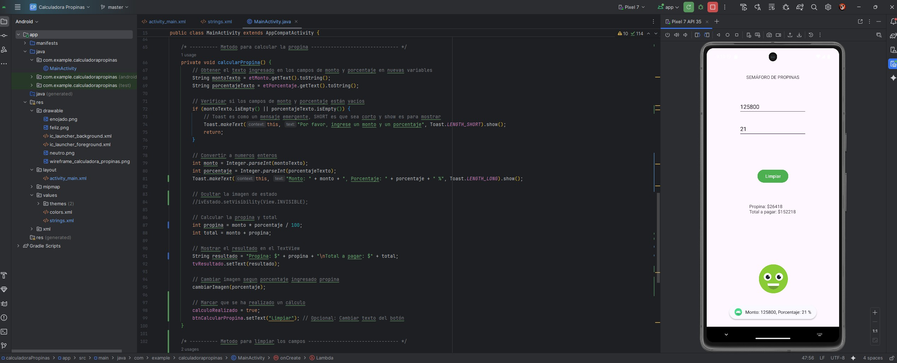
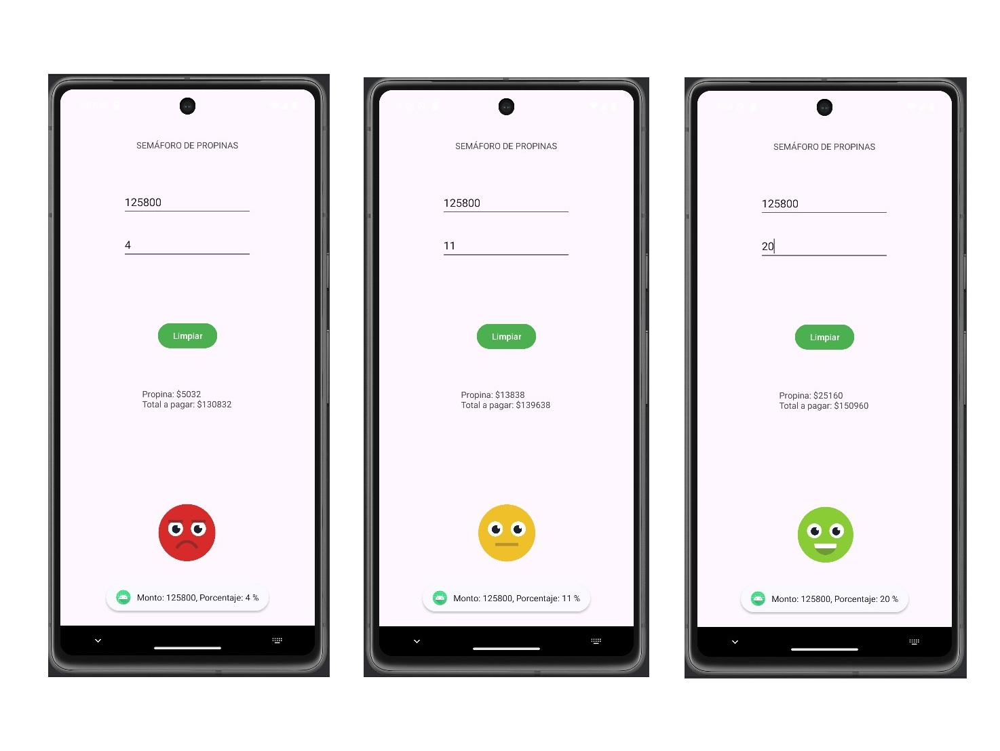

**_<h1 align="center">:vulcan_salute: Ejercicios Plataforma :computer:</h1>_**

<!-- ---------------------------------------------------------------------------------------------- -->

**<h2 align="center">&#128204; Proyectos Realizados en Clases</h2>**

[GitHub Pages - Proyectos Realizados en Clases - Bootcamp Desarrollo Aplicaciones Móviles](https://kathyalde21.github.io/ejercicios_bootcamp_app_mov/proyectosClases.html)

<!-- ---------------------------------------------------------------------------------------------- -->
  

<table>
    <tr>
        <td align="center" width="50%">
            
            
            <strong>Contador Android Java</strong> 
            
App realizada con Android Studio que permite aumentar o disminuir al hacer click en el botón que corresponda.

            | <a class="readme-link" href="https://github.com/KathyAlde21/contador_android_java">
            Proyecto Android</a> | 
        </td>
        <td align="center" width="50%">
            
            
            <strong>Calculadora de Propinas - Semáforo</strong> 
            
Permite calcular según valores ingresados y utiliza caras con los colores de un semáforo para indicar si la propina es baja, media o alta.

            | <a class="readme-link" href="https://github.com/KathyAlde21/calculadora_propinas_android_java">
            Proyecto Android</a> | 
        </td>
    </tr>
</table>

  

<table>
    <tr>
        <td align="center" width="60%">
            
            
            <strong>Login - Nombre de usuario y Contraseña</strong> 
            
Permite ingresar datos para registro de sesion. Incluye validaciones de campos vacios y formato de correo. 
            Inicialmente el manejo de btn_tv fue con animacion y mensaje indicando que esta pendiente la configuración. 
            En una segunda etapa se les dio funcionalidad.

            | <a class="readme-link" href="https://github.com/KathyAlde21/login_android_java_kotlin">
            Proyecto Android</a> | 
        </td>
        <td align="center" width="38%">
              
            <strong>Contactos - Nombre y Teléfono</strong> 
            
Código en Kotlin desarrollado en Android Studio para ver contactos usando compose. Muestra nombre y teléfono.

            | <a class="readme-link" href="https://github.com/KathyAlde21/contactos_compose_kotlin.git">
            Proyecto Android</a> | 
        </td>
    </tr>
</table>

