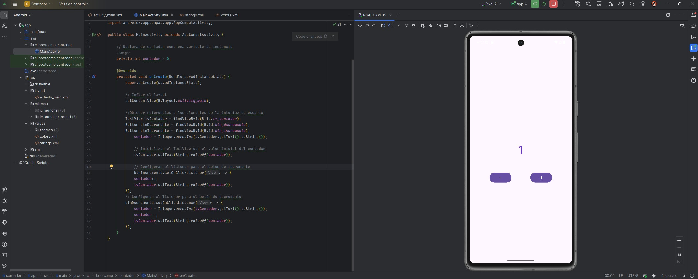
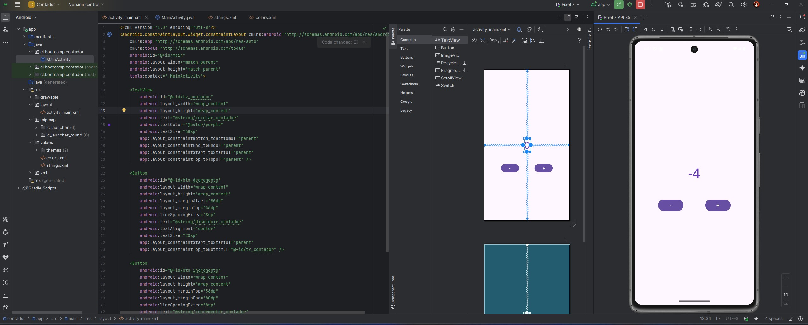
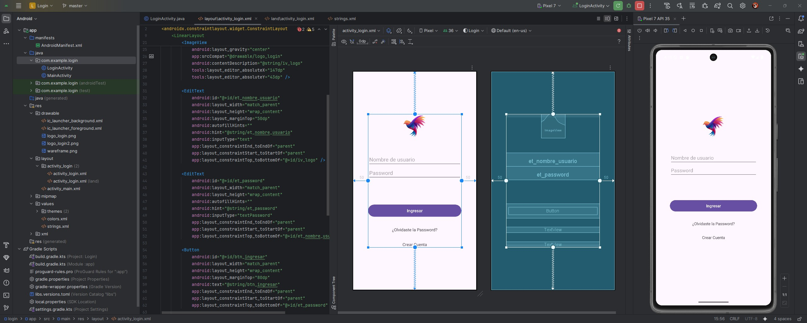
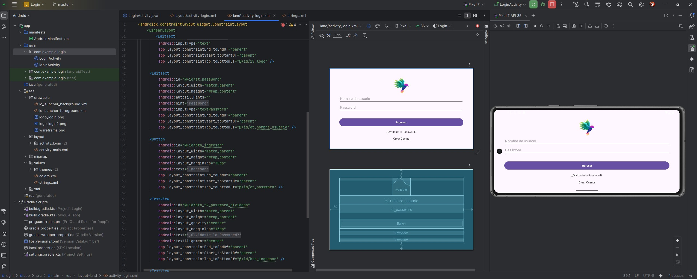
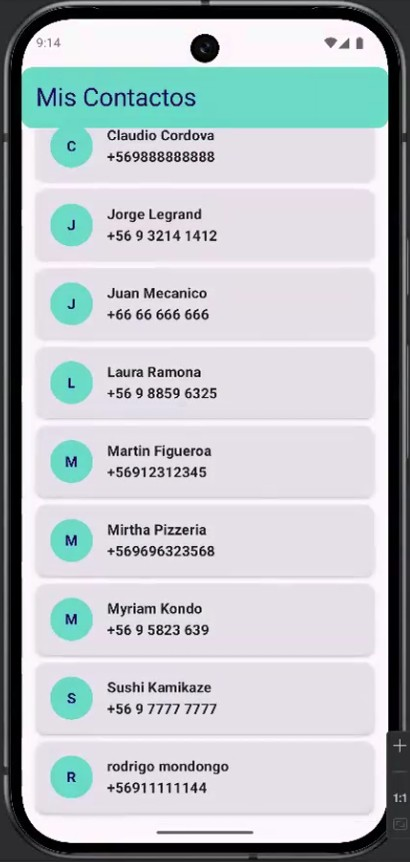

**_<h1 align="center">:vulcan_salute: Ejercicios Plataforma :computer:</h1>_**

<!-- ---------------------------------------------------------------------------------------------- -->

**<h2 align="center">&#128204; Proyectos Realizados en Clases</h2>**

[GitHub Pages - Proyectos Realizados en Clases - Bootcamp Desarrollo Aplicaciones Móviles](https://kathyalde21.github.io/ejercicios_bootcamp_app_mov/proyectosClases.html)

Esta página reúne algunos proyectos desarrollados en clases, principalmente como ejercicios breves para practicar conceptos específicos en Android, Kotlin y manejo de interfaces.

A diferencia de los módulos, acá no se trata tanto de una progresión completa, sino de trabajos más puntuales que me sirvieron para reforzar ideas concretas y probar componentes o interacciones en un contexto más acotado.

<table>
    <tr>
        <td align="center">
            
             
            <strong>Contador en Android</strong> 
            
Aplicación desarrollada en Android Studio que permite aumentar o disminuir un valor mediante botones.

            | <a class="readme-link" href="https://github.com/KathyAlde21/contador_android_java">
            Proyecto Android</a> | 
        </td>
    </tr>
    <tr>
        <td align="center">
            
             
            <strong>Login con usuario y contraseña</strong> 
            
Aplicación desarrollada en Android Studio para ingreso de sesión, con validación de campos vacíos y formato de correo. En una primera etapa algunos controles funcionaban como prueba visual y luego fueron completados con comportamiento real.

            | <a class="readme-link" href="https://github.com/KathyAlde21/login_android_java_kotlin">
            Proyecto Android</a> | 
        </td>
    </tr>
        <tr>
        <td align="center">
              
            <strong>Contactos en Compose</strong> 
            
Proyecto en Kotlin desarrollado en Android Studio con Jetpack Compose para mostrar contactos con nombre y teléfono.

            | <a class="readme-link" href="https://github.com/KathyAlde21/contactos_compose_kotlin.git">
            Proyecto Android</a> | 
        </td>
    </tr>
</table>

